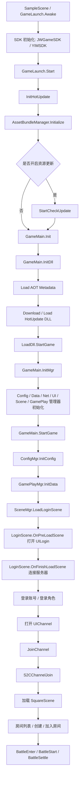

# 启动-热更-登录-进服最小闭环分析

生成时间：2026-06-29  
分析目标：面向首次技术测试，确认玩家从启动客户端到进入频道、进入场景、进入房间、开始玩法的最小链路是否具备可测性，并识别会阻断首测的高优先级风险。

## 1. 结论摘要

当前项目的主链路不是原型级状态，启动、热更 DLL、配置加载、UI 打开、网络协议注册、登录、频道、场景、房间、战斗等环节都有完整代码路径。以“研发期、当前版本基本完成、正在修 bug、下月首次技术测试”的背景看，结论是：

> 首测可以推进，但必须把验证重心放在真机真包、热更资源完整性、弱网断线、服务端环境、埋点/崩溃日志五类问题上。  
> 编辑器能跑通不能代表首测包安全，当前工程最容易出问题的是运行时装配链路。

优先级最高的风险：

| 风险 | 当前证据 | 对首测的影响 | 优先级 |
|---|---|---|---|
| 热更 DLL / AOT 元数据缺失或包体清单不一致 | `LoadDll` 运行时按固定列表加载 13 个 DLL；AOT 元数据按固定列表加载 | 启动黑屏、卡 loading、反射类型不存在、真机崩溃 | P0 |
| 断线/重连路径不完整 | `NetworkManager.IsConnect()` 固定返回 true；断线弹窗与登出逻辑被注释；`ReConnect()` TODO 后直接跳广场 | 首测弱网下玩家卡死、状态错乱、房间/战斗无法恢复 | P0 |
| 频道加入采用乐观式 UI | 发送频道加入请求时立即广播 UI 加载结果，UIChannel 立即打开 loading 并关闭自身，服务器回包后才加载广场 | 频道加入失败或超时时玩家可能无反馈卡 loading | P0 |
| 配置与资源路径依赖强 | 配置表、UIConfig、Prefab、场景配置、AssetBundle 同时参与运行时加载 | 少一项就会在启动或进入功能时暴露，且错误位置分散 | P0 |
| Bugly/线上可观测能力疑似未接入 | `GameLaunch.Awake()` 中 `BuglyInit` 被注释 | 首测崩溃和关键异常难以归因，修 bug 效率低 | P0 |

## 2. 最小闭环链路

## 3. 源码证据与节点分析

### 3.1 启动入口

证据：

- `Assets/Scripts/GameLaunch.cs:23-34`：`Awake()` 设置帧率、`DontDestroyOnLoad`，初始化 `JWGameSDK`、`YIMSDK`，但 `BuglyInit` 被注释。
- `Assets/Scripts/GameLaunch.cs:36-69`：`Start()` 依次执行热更初始化、AssetBundle 初始化、可选更新检查、`GameMain.Init()` 和 `StartGame()`。
- `Assets/Scripts/GameLaunch.cs:161-168`：`StartGame()` 串行执行 `GameMain.InitDll()`、`GameMain.InitMgr()`、`GameMain.StartGame()`。

判断：

启动结构是清楚的，属于典型 Unity + 热更 + 资源管理启动器。首测风险不在“有没有入口”，而在入口链路依赖较多，任何一步失败都会阻断后续登录。

首测必须验证：

- Android 真包首次安装启动。
- Android 真包二次启动。
- 清缓存后启动。
- 网络不可用、弱网、更新中断后启动。
- 更新资源存在差异时的启动。

### 3.2 热更 DLL 和 AOT 元数据

证据：

- `Assets/Scripts/GameMain.cs:36-56`：非编辑器下先加载 AOT 元数据，再下载/加载热更 DLL，最后 `LoadDll.StartGame()`。
- `Assets/Scripts/GameCore/LoadDll.cs:49-65`：非编辑器运行时按固定列表 `Assembly.Load`：`GameCore.dll`、`Config.dll`、`GameCommon.dll`、`Proto.dll`、`Manager.dll`、`DataManager.dll`、`Character.dll`、`Battle.dll`、`GamePlay.dll`、`Net.dll`、`Scene.dll`、`UI.dll`、`Timeline.dll`。
- `Assets/Scripts/GameCore/LoadDll.cs:118-155`：同一固定列表通过 `AssetBundleManager.RequestAssetFileAsync(asset)` 获取字节。
- `Assets/Scripts/GameCore/LoadDll.cs:157-178`：`UNITY_HYBRIDCLR` 下加载 `System.dll`、`System.Core.dll`、`mscorlib.dll`、`Framework.dll` 元数据。

判断：

这是当前工程的关键地基。由于底层和基础模块历史上多次推翻，最容易出现“编辑器没问题，真包加载不到某个 DLL 或 AOT 类型”的问题。这里建议研发不要只口头确认，要输出一次可审计的打包产物清单。

首测必须验证：

- 打包后资源清单中包含上述 13 个热更 DLL。
- 打包后资源清单中包含 HybridCLR AOT 元数据文件。
- Android 宏定义与 HybridCLR 流程一致。
- 真机启动日志中打印每个 DLL 和 AOT 元数据加载成功。
- 每次 CI/出包后自动比对 DLL 清单。

### 3.3 管理器初始化

证据：

- `Assets/Scripts/GameMain.cs:112-130`：`StartGame()` 打开 loading，初始化配置，初始化玩法数据，然后加载登录场景。
- `Assets/Scripts/GameCore/ConfigMgr.cs`、`DataMgr.cs`、`GamePlayMgr.cs`、`SceneMgr.cs` 等桥接类通过反射调用热更侧实际类型。
- `Assets/Scripts/Net/NetworkManager.cs:55-78`：网络初始化会注册登录、频道、场景、房间、战斗、玩家、道具、好友、聊天、邮件、排行、商店、拍照、音乐、活动、任务等协议扩展。

判断：

管理器分层基本完整，体现了基础框架、业务数据、网络协议、场景、UI 的职责拆分。风险在于大量桥接和事件注册都是运行时行为，编译期保护有限。一旦方法名、类型名、DLL 装载顺序发生变化，问题会在运行时才暴露。

首测必须验证：

- 进入登录页前无反射异常。
- 网络协议注册没有重复注册/漏注册。
- 退出登录、重进角色、切号时不会重复初始化导致多次回调。

### 3.4 配置加载

证据：

- `Assets/Scripts/Config/ConfigManager.cs` 使用固定 `_configNames` 列表加载配置。
- 缺资源时会打印 `LoadConfig Error`，但之后仍会访问 `asset.text`，存在空引用风险。
- 配置名中存在 `data_tbdancemodeconfig_030test` 这类测试痕迹。

判断：

配置体系规模较大，说明内容已经铺开；但配置加载容错偏弱。首次技术测试前，要把配置完整性当作阻断项处理，而不是等 QA 点到具体功能才发现。

首测必须验证：

- 配置表导出与客户端读取列表一致。
- 每张配置 JSON 在 AssetBundle 中存在。
- 配置 ID 引用的 UI、场景、道具、音乐、特效资源存在。
- 打包时执行配置完整性扫描。

### 3.5 登录和角色

证据：

- `Assets/Scripts/Scene/LoginScene.cs:32-48`：登录场景预加载阶段打开 `UILogin`，并预加载部分资源。
- `Assets/Scripts/Scene/LoginScene.cs:50-54`：登录场景加载完成后广播 `MN_NET_CONNECT` 连接服务器。
- `Assets/Scripts/Net/ProtoExtensions/LoginProtoExtensions.cs:78-100`：账号登录回包后初始化 `DataManager`、`GamePlay`、`DataManager.InitData()`，无角色则打开创建角色，有角色则发送登录角色。
- `Assets/Scripts/Net/ProtoExtensions/LoginProtoExtensions.cs:83-85`：存在“临时方案，防止服务器发多次登录，CB5后再看”的注释。
- `Assets/Scripts/Net/ProtoExtensions/LoginProtoExtensions.cs:102-128`：角色登录成功后写入 Token 和主角数据，打开 `UIChannel`，登录 YouMe 聊天。

判断：

登录链路基本完整，但有两点需要特别关注：  
第一，账号登录回包处有临时防重复逻辑，说明历史上出现过服务端重复下发或客户端重复处理问题。  
第二，登录成功后一次性触发数据、UI、聊天多个系统，任何一个系统异常都可能表现为登录卡住。

首测必须验证：

- 新账号创建角色。
- 老账号登录角色。
- 快速重复点击登录。
- 服务端重复下发登录回包。
- 登录后聊天 SDK 登录失败时主流程是否继续。

### 3.6 频道进入

证据：

- `Assets/Scripts/UI/Channel/UIChannel.cs:253-263`：点击进入频道后调用 `ChannelDataManager.Instance.JoinChannel(_nSelChannel)`。
- `Assets/Scripts/DataManager/ChannelDataManager.cs:181-186`：`JoinChannel()` 广播 `MN_NET_CHANNEL_JOIN`。
- `Assets/Scripts/Net/ProtoExtensions/ChannelProtoExtensions.cs:101-119`：发送频道加入请求时先广播 `MN_UICHANNEL_JOIN_RESULT`，再发送 `C2SChannelJoin`，并提前设置 `NetworkManager.ChannelId`。
- `Assets/Scripts/UI/Channel/UIChannel.cs:185-189`：收到 `MN_UICHANNEL_JOIN_RESULT` 后立即打开 loading 并关闭频道 UI。
- `Assets/Scripts/Net/ProtoExtensions/ChannelProtoExtensions.cs:64-89`：服务器 `S2CChannelJoin` 回包后，根据场景类型加载广场或处理房间场景，并加入 YouMe 频道聊天。

判断：

这是首测高风险节点。客户端在服务端确认前就关闭 UI 并进入 loading，如果请求失败、超时、服务端不回包、网络断开，玩家可能留在不可操作状态。并且 `NetworkManager.ChannelId` 被提前设置，失败后状态回滚不明显。

建议：

- P0：频道加入必须加超时处理和失败回滚。
- P0：`MN_UICHANNEL_JOIN_RESULT` 更名或调整语义，避免“请求已发出”被当作“加入成功”。
- P1：频道加入失败后回到频道选择界面，并展示明确错误。

### 3.7 场景加载

证据：

- `Assets/Scripts/Scene/SceneManager.cs:18-30`：初始化时注册 `MN_SCENE_LOADSCENE` 和 `MN_NET_SCENE_RESPONSE`。
- `Assets/Scripts/Scene/SceneManager.cs:66-81`：登录场景或本地加载直接切场景；其他场景先广播 `MN_NET_SCENE_JOIN` 请求服务端。
- `Assets/Scripts/Scene/SceneManager.cs:83-86`：收到服务端场景响应后再真正加载场景。
- `Assets/Scripts/Scene/SceneManager.cs:88-147`：根据 `ESceneType` 创建具体场景对象并执行 `OnLoadScene()`。
- `Assets/Scripts/Scene/BaseScene.cs`：场景加载过程执行 `OnPreLoadScene()`、资源加载、`OnFinishLoadScene()`、`OnLateLoadScene()`。

判断：

场景加载与服务端状态绑定，方向合理，适合多人在线项目。但首测要警惕“服务端状态、客户端场景、UI loading”三者不同步。比如频道已认为成功、服务端场景未响应、客户端 loading 无超时，就会表现为卡进度。

首测必须验证：

- 登录场景到广场。
- 广场到房间。
- 房间到战斗。
- 战斗结算回房间或广场。
- 切场景中断网。
- 切场景期间后台/前台切换。

### 3.8 房间与战斗

证据：

- `Assets/Scripts/DataManager/RoomDataManager.cs:203-217`：创建房间组装 `CRoomDetailData` 后广播 `MN_NET_ROOM_CREATE`。
- `Assets/Scripts/DataManager/RoomDataManager.cs:240-257`：进入房间时根据是否有密码打开密码 UI 或广播 `MN_NET_ROOM_JOIN`。
- `Assets/Scripts/Net/ProtoExtensions/RoomProtoExtensions.cs:187-210`：加入房间回包成功后创建房间信息，刷新场景玩家数据。
- `Assets/Scripts/GamePlay/RoomInfoManager.cs:147-155`：准备状态变化时广播 `MN_NET_ROOM_READY`。
- `Assets/Scripts/GamePlay/RoomInfoManager.cs:560-574`：离开房间时广播离开消息，回包后清理聊天房间和主角房间 ID。
- `Assets/Scripts/Net/ProtoExtensions/BattleProtoExtensions.cs`：战斗进入、开始、提交、结算消息均有注册与处理。

判断：

房间和战斗链路已经具备可测形态。需要重点验证多人同步、准备状态、房主离开、断线、战斗中结算等边界，不宜只跑单人自测路径。

首测必须验证：

- 创建普通房间。
- 加入他人房间。
- 房间准备/取消准备。
- 房主开始战斗。
- 双人或多人进入战斗。
- 战斗中断线、后台切换、返回。
- 战斗结算与奖励展示。

## 4. P0 冒烟验收用例

| 用例 | 路径 | 期望结果 | 失败信号 | 建议负责人 |
|---|---|---|---|---|
| S0-01 | 安装真包后首次启动 | 进入登录 UI，无黑屏、无异常弹窗 | 卡启动、崩溃、无日志 | 客户端/QA |
| S0-02 | 开启更新模式启动 | 检查更新、下载、进入登录 | 资源下载失败、进度不动 | 客户端/运维 |
| S0-03 | 清缓存后启动 | 能重新初始化资源并进入登录 | DLL 或配置加载失败 | 客户端 |
| S0-04 | 登录已有账号 | 成功打开频道选择 | 登录重复回包、卡登录 | 客户端/服务端 |
| S0-05 | 新账号创建角色 | 创建后进入频道 | 创建成功但数据未初始化 | 客户端/服务端 |
| S0-06 | 加入频道 | 加载广场并加入聊天频道 | 频道 UI 关闭后卡 loading | 客户端/服务端 |
| S0-07 | 广场切换 | 广场角色和基础 UI 正常 | 场景加载失败、玩家数据为空 | 客户端 |
| S0-08 | 创建房间 | 成功进入自己房间 | 创建回包失败无提示 | 客户端/服务端 |
| S0-09 | 加入房间 | 成功进入他人房间 | 房间数据错乱、座位错乱 | 客户端/服务端 |
| S0-10 | 房间准备并开始 | 进入战斗场景 | 准备状态不同步、无法开始 | 客户端/服务端 |
| S0-11 | 完成一局战斗 | 有结算，有返回路径 | 结算丢失、返回失败 | 客户端/服务端/策划 |
| S0-12 | 登录后断网 30 秒再恢复 | 有明确提示或可恢复路径 | 无提示、假连接、状态错乱 | 客户端 |
| S0-13 | 频道 loading 中断网 | 超时返回频道 UI | 卡死 loading | 客户端 |
| S0-14 | 战斗中切后台再回来 | 不崩溃，状态合理 | 音频/网络/动画异常 | 客户端 |
| S0-15 | 崩溃与错误采集 | Bugly 或等效平台能看到崩溃和关键日志 | 无崩溃记录、无法定位 | 客户端/运维 |

## 5. 首测前必须向研发确认的清单

1. 本次首测目标平台、包号、版本号、资源版本号、热更版本号。
2. Android 包是否启用 HybridCLR，相关宏和打包流程是否固定。
3. 热更 DLL 产物清单，是否包含 `LoadDll` 固定加载的 13 个 DLL。
4. AOT 元数据清单，是否包含 `System.dll`、`System.Core.dll`、`mscorlib.dll`、`Framework.dll`。
5. AssetBundle manifest 是否可导出并做自动校验。
6. 配置导出是否进入出包流水线，是否做缺表/缺字段/缺资源扫描。
7. 首测服务器域名、端口、灰度环境和正式测试环境是否区分。
8. 当前 `jw-game-api-dev.auforever.com:8712` 是否就是首测环境。
9. 断线、重连、踢号、维护公告的预期产品表现。
10. Bugly 或其他崩溃平台是否接入真包。
11. 是否有每日构建和冒烟报告。
12. 是否有 P0/P1 bug 列表、关闭标准和延期标准。

## 6. 对当前开发进度的客观评价

从源码规模和主链路完整度看，项目已经越过“功能有没有”的阶段，进入“真机真服稳定性、体验闭环、边界条件、可观测性”阶段。研发团队说当前版本基本完成、正在修 bug，这与代码状态基本吻合。

但因为项目底层和基础系统历史上多次改动，当前最不应该低估的是“系统间拼接风险”。这些风险不一定表现为某个模块没写完，而是表现为：

- 编辑器能跑，真包不行。
- 单人能跑，多人不行。
- 正常网络能跑，弱网不行。
- 第一次登录能跑，切号/重登/重复回包不行。
- 功能路径能跑，崩溃后没有日志，定位慢。

因此，下月首次技术测试的合理目标不是“证明所有内容完整”，而是：

> 证明启动、更新、登录、进频道、进广场、进房间、打一局、结算、断线恢复、崩溃采集这条链路在真机真包上可重复跑通。

如果这条链路稳定，项目具备进入更大规模测试的基础。  
如果这条链路还经常中断，继续堆功能或开放大量外围系统都会放大 bug 面。

## 7. 建议的首测准入标准

建议把以下条件设为“首测前必须达成”：

| 准入项 | 标准 |
|---|---|
| 真包启动 | 10 台不同 Android 设备首次启动成功率 100% |
| 热更完整性 | DLL、AOT、配置、AssetBundle 清单自动校验通过 |
| 登录链路 | 新老账号各 20 次登录无卡死 |
| 频道链路 | 加入频道失败有超时和回退，不允许无限 loading |
| 最小玩法 | 至少 2 人完整完成 20 局房间战斗闭环 |
| 弱网 | 断网、切后台、网络切换有明确表现，不出现假连接 |
| 崩溃采集 | 真包崩溃能在平台看到设备、版本、堆栈 |
| Bug 管理 | P0 全清，P1 有明确 owner 和修复计划 |

## 8. 后续建议分析专题

接下来建议继续拆 4 份专题：

1. **模块架构全景图**：基础框架、热更、资源、配置、网络、数据、UI、场景、玩法、SDK 的依赖关系。
2. **功能模块完成度评估**：登录、角色、广场、房间、战斗、换装、商城、好友、聊天、活动、任务、拍照、婚礼/心动房等。
3. **资源与配置一致性扫描**：UIConfig、Prefab、SceneConfig、配置 JSON、StreamingAssets/AssetBundle 的缺失和冗余。
4. **首测风险台账**：按 P0/P1/P2 建立问题、证据、影响、建议、owner、验收标准。

