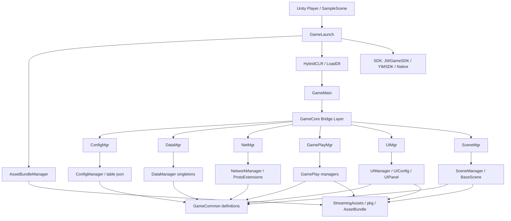
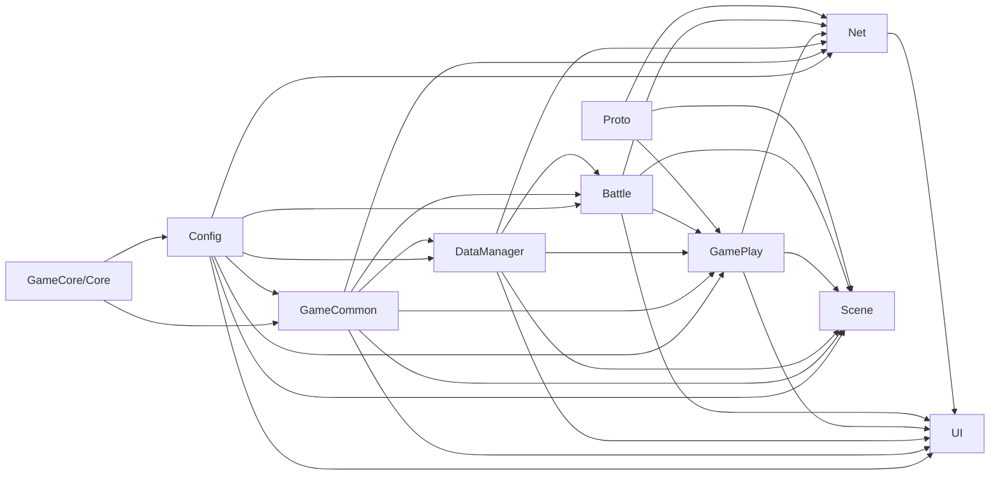

# 模块架构全景图

生成时间：2026-06-29  
分析目标：从项目结构、asmdef 依赖、启动初始化、运行时通信、业务模块分布几个角度，给出当前手游客户端的架构画像，并判断其对首次技术测试的支撑程度和风险点。

## 1. 总体判断

这是一个 Unity 2022.3.57f1c1 客户端项目，采用 HybridCLR 热更、AssetBundle 资源加载、事件总线通信、配置驱动 UI/场景、协议扩展注册的架构。项目已经不是早期原型，核心业务模块和外围系统都已展开。

从架构状态看，当前项目可以概括为：

> 底层框架基本成型，业务模块覆盖面较广，首测链路具备可测基础；但上层模块耦合偏重，运行时装配点较多，历史重构痕迹会放大真机包、弱网、资源配置不一致时的风险。

最重要的制作人视角结论：

| 维度 | 评价 | 说明 |
|---|---|---|
| 架构完整度 | 较高 | 启动、热更、资源、配置、网络、数据、UI、场景、玩法、SDK 均有明确模块 |
| 工程模块化 | 中上 | 主要脚本模块有 asmdef，但 UI/Scene/Net/GamePlay 依赖较宽 |
| 首测支撑度 | 有条件支撑 | 主链路可测，但必须真包验证 DLL、资源、配置、网络和 SDK |
| 稳定性风险 | 中高 | 反射、事件总线、配置路径、热更资源、弱网重连是主要风险 |
| 后续维护成本 | 偏高 | UI 和业务系统体量大，模块间直接依赖较多，历史残留需要治理 |

## 2. 代码规模画像

脚本模块规模：

| 模块 | 文件数 | 行数 | 判断 |
|---|---:|---:|---|
| Proto | 27 | 117750 | 协议生成代码，体量大但不代表手写复杂度 |
| UI | 375 | 59488 | 最大手写业务层，功能覆盖非常广，也是集成风险最高层 |
| DataManager | 23 | 12398 | 玩家、房间、好友、活动、商城、任务等数据中心 |
| SDK | 44 | 11002 | 平台 SDK、YouMe IM、登录支付分享等 |
| Config | 146 | 10598 | 配置表访问层，内容规模较大 |
| GamePlay | 43 | 9569 | 战斗、场景玩家、声音、聊天、拍照、婚礼、引导等玩法管理 |
| Net | 40 | 8096 | 协议注册和收发扩展 |
| GameCommon | 38 | 7831 | 事件名、UIConfig、SceneConfig、通用定义 |
| Character | 14 | 4949 | 角色表现 |
| Scene | 14 | 2745 | 登录、广场、房间、战斗、婚礼、拍照、心动房等场景 |
| Battle | 11 | 2378 | 音舞战斗逻辑 |
| GameCore | 8 | 483 | 热更桥接层 |
| Manager | 2 | 362 | 效果等通用管理 |
| Core | 1 | 361 | 资源、事件、网络、对象池等框架门面 |
| Timeline | 13 | 255 | Timeline 相关逻辑 |

判断：

- UI 是最大风险面，不只是界面数量多，还因为 UI 直接调用 DataManager、GamePlay、Net、Battle、SDK 等多个系统。
- Proto 行数很大但主要是生成代码，评估进度时不应把它等同于业务完成度。
- DataManager、GamePlay、Net、Config、SDK 均在 8k-12k 行量级，说明主业务已经铺开。
- Timeline 行数很少但被婚礼/演出链路依赖，不能只按行数判断重要性。

## 3. 架构分层图

## 4. 启动与运行时装配

当前启动链路：

1. `GameLaunch.Awake()` 初始化帧率、常驻对象、SDK、YouMe 语音监听。
2. `GameLaunch.Start()` 初始化热更和 AssetBundle，按需执行资源更新检查。
3. `GameMain.InitDll()` 加载 HybridCLR AOT 元数据和 13 个热更 DLL。
4. `LoadDll.StartGame()` 通过 `Assembly.Load` 装配业务程序集。
5. `GameMain.InitMgr()` 通过桥接层启动 Config、Data、Net、GamePlay、UI、Scene。
6. `GameMain.StartGame()` 加载配置和玩法数据，进入登录场景。

源码证据：

- `Assets/Scripts/GameLaunch.cs:23-69`：启动、SDK、AssetBundle、更新检查、进入 `GameMain`。
- `Assets/Scripts/GameMain.cs:36-56`：加载 AOT 元数据和热更 DLL。
- `Assets/Scripts/GameCore/LoadDll.cs:49-65`：运行时加载 `GameCore.dll`、`Config.dll`、`GameCommon.dll`、`Proto.dll`、`Manager.dll`、`DataManager.dll`、`Character.dll`、`Battle.dll`、`GamePlay.dll`、`Net.dll`、`Scene.dll`、`UI.dll`、`Timeline.dll`。
- `Assets/Scripts/GameMain.cs:59-76`：初始化 Input、Config、Data、Net、GamePlay、UI、Scene。

架构评价：

这种设计适合需要热更的手游，但首测风险也很明确：运行时装配链路长，编辑器与真包差异大。只要 DLL、AOT、AssetBundle、宏定义、反射方法名中任何一环不一致，都可能造成启动失败或功能缺失。

## 5. asmdef 模块依赖

核心脚本模块都有 asmdef：

- `Battle`
- `Character`
- `Config`
- `GameCore`
- `DataManager`
- `GameCommon`
- `GamePlay`
- `Manager`
- `Net`
- `Proto`
- `Scene`
- `Timeline`
- `UI`

主要依赖关系：

说明：

- `GameCore` 和 `Proto` 相对底层，依赖较少。
- `Config`、`GameCommon` 是广泛被依赖的基础层。
- `DataManager` 是业务数据中心，被 Battle、GamePlay、Net、Scene、UI 广泛依赖。
- `UI`、`Scene`、`Net`、`GamePlay` 是高耦合上层模块，依赖面较宽。
- 部分 asmdef 引用 GUID 在当前脚本模块中未直接映射，另有 `UniTask`、`DotweenP`、`NativeGallery.Runtime` 等插件引用。建议后续做一次完整依赖清单治理，确认没有历史残留引用。

风险判断：

高耦合不等于不可用，但它会造成两个结果：

- 排查问题时链路长：UI 报错可能来自配置、资源、数据、网络、玩法或 SDK。
- 模块重构成本高：改房间、战斗、聊天、商城时可能牵动 UI、DataManager、Net、GamePlay 多处。

## 6. 运行时通信模型

当前主要通信方式：

| 通信方式 | 使用位置 | 特点 | 风险 |
|---|---|---|---|
| EventManager 事件总线 | UI、DataManager、Net、Scene、GamePlay | 模块间解耦，调用方便 | 事件名/参数靠约定，漏注册和重复注册不易发现 |
| NetMsgMap 协议注册 | `ProtoExtensions` | 服务端消息分模块处理 | 协议回包与 UI 状态不同步时容易卡流程 |
| Singleton 管理器 | DataManager、GamePlay | 访问方便，状态集中 | 生命周期和重进游戏/切号风险较高 |
| 反射桥接 | GameCore bridge | 支持热更程序集隔离 | 编译期保护弱，真包才暴露类型/方法缺失 |
| UIConfig / SceneConfig | UI/场景驱动 | 配置化加载资源 | 配置与 Prefab/Scene/AB 不一致会导致运行时失败 |

事件域分布：

- `MN_UIMANAGER_*`：UI 打开、关闭、重开、是否打开。
- `MN_NET_*`：登录、频道、场景、房间、玩家、好友、家族、活动、商城、战斗等网络请求。
- `MN_DATA_*`：玩家、房间、好友、邮件、道具、任务、成就等数据刷新。
- `MN_SCENE_*`：场景加载、玩家刷新、镜头、触发器。
- `MN_YOUME_CHAT_*`：聊天、语音、频道加入/离开。
- `MN_SOUND_*`：背景音乐、音效、音乐播放控制。

源码证据：

- `Assets/Scripts/GameCommon/MessageName.cs` 定义大量 `EEventID` 和旧式字符串事件名。
- `Assets/Scripts/UI/UIManager.cs:107-112` 注册 UI 管理事件。
- `Assets/Scripts/Net/NetworkManager.cs:55-79` 注册协议扩展和网络连接事件。
- `Assets/Scripts/Scene/SceneManager.cs:27-28` 注册场景加载与服务端场景响应事件。

架构评价：

事件总线适合快节奏业务开发，但项目已经到 5-6 万行 UI 和多系统联动阶段，事件治理需要加强。建议至少对首测主链路事件建立清单：发送方、接收方、参数、是否允许重复、失败回退。

## 7. 资源与 UI 架构

UI 架构：

- `UIManager` 统一负责打开/关闭 UI。
- `UIConfig` 定义 UIFlag 到 PrefabPath、层级、全屏/弹窗等配置。
- UI 实例通过 `PoolManager.Spawn(config.PrefabPath)` 加载。
- UI 根节点运行时创建 `UIRoot`、`EventSystem`、`UICamera`，并区分 Bottom、Normal、PopUp、Top 层。

源码证据：

- `Assets/Scripts/UI/UIManager.cs:91-113`：初始化 UIRoot、UIConfig、注册 UI 事件。
- `Assets/Scripts/UI/UIManager.cs:203-230`：统一打开 UI。
- `Assets/Scripts/UI/UIManager.cs:319-349`：按 UIConfig 的 PrefabPath 从对象池加载 UI。
- `Assets/Scripts/GameCommon/UIConfig.cs:254` 起：配置大量 UI。
- `Assets/Scripts/Core/Core.cs:234-303`：`PoolManager` 绑定资源加载函数并提供 Spawn/DeSpawn。

UI 目录规模 Top 10：

| UI 子模块 | 文件数 | 行数 | 判断 |
|---|---:|---:|---|
| Common | 52 | 6941 | 通用 UI 基础组件和弹窗，影响面最大 |
| PhotoStudio | 29 | 6140 | 拍照玩法体量大 |
| Chat | 19 | 4194 | 聊天复杂度较高，且依赖 YouMe/网络 |
| HeartbeatMate | 29 | 3560 | 心动房/匹配相关功能较重 |
| Friend | 19 | 3478 | 社交链路较完整 |
| TaskCenter | 11 | 2569 | 任务中心 |
| AcitivityCenter | 20 | 2434 | 活动中心，注意目录名拼写为 AcitivityCenter |
| Battle | 16 | 2396 | 战斗 UI |
| PersonalShop | 9 | 2375 | 个性化商城 |
| ClothingExchange | 18 | 2328 | 服装兑换 |

风险判断：

- UIConfig 与 Prefab 的一致性是首测 P0 检查项。
- Common UI 出问题会影响大量界面。
- Chat、PhotoStudio、HeartbeatMate、Activity、Shop 等模块体量较大，建议首测不要一次性开放所有外围功能。
- 目录中存在拼写问题如 `AcitivityCenter`，不一定影响运行，但说明历史命名治理不足。

## 8. 数据层架构

`DataManager.DataManager` 是数据管理器总入口，初始化以下系统：

- ChannelDataManager
- AnnouncementDataManager
- RoomDataManager
- ScenePlayerDataManager
- PlayerDataManager
- ItemDataManager
- FriendDataManager
- FamilyDataManager
- ActivityDataManager
- RankDataManager
- ClothingExchangeManager
- MusicDataManager
- ShopManager
- RedDotDataManager
- RedeemShopDataManager
- MailDataManager
- TaskDataManager
- AchievementsDataManager
- MainIconDataManager
- SettingDataManager

源码证据：

- `Assets/Scripts/DataManager/DataManager.cs:7-33`：初始化列表。
- `Assets/Scripts/DataManager/DataManager.cs:35-60`：Dispose 列表。
- `Assets/Scripts/DataManager/DataManager.cs:63-78`：登录后数据初始化。

架构评价：

DataManager 层承担了几乎所有长期状态和服务端数据缓存，是业务中台。这个设计便于 UI 读取数据，但容易出现“状态集中、生命周期复杂”的问题，尤其是登录、切号、断线重连、重新进房间时。

首测重点：

- 登录后数据初始化是否完整。
- 退出登录/踢号后数据是否清干净。
- 重复登录回包是否导致重复 Init。
- 房间、场景玩家、主角数据是否一致。

## 9. 网络层架构

网络层由 `NetworkManager` 统一初始化，具体业务协议按 `ProtoExtensions` 拆分：

- Login
- Channel
- Announcement
- Scene
- Room
- Battle
- Player
- Item
- Soulmate
- Friend
- Family
- Clothing
- Chat
- Mail
- Rank
- Shop
- PhotoStudio
- Music
- Activity
- Task

源码证据：

- `Assets/Scripts/Net/NetworkManager.cs:49-83`：网络初始化和协议扩展注册。
- `Assets/Scripts/Net/ProtoExtensions` 下有 18 个协议扩展文件。

架构评价：

协议按业务拆分是好的，说明业务边界存在。但 `NetworkManager` 里服务器地址硬编码为 `jw-game-api-dev.auforever.com:8712`，并有多条内网 IP 注释；`FamilyProtoExtensions.Init()` 被注释；断线重连逻辑未完整启用。这些都说明网络层还处于研发期形态。

首测重点：

- 首测服务器环境必须明确，不要用“开发服顺手测”替代。
- 协议注册/注销要验证是否成对。
- 弱网、断网、服务器维护、踢号必须走通产品表现。
- 已注释的 Family 协议如果功能入口开放，要确认是否服务端/客户端双侧可用。

## 10. 场景与玩法架构

场景层：

- LoginScene
- SquareScene
- RoomScene
- BasketballScene / BattleScene
- WeddingRoomScene
- WeddingScene
- PhotoRoom
- HeartbeatMateRoom

玩法层：

- RoomInfoManager
- SoulmateManager
- ScenePlayerManager
- SoundManager
- ChatDataManager
- PhotoStudioManager
- BattleManager
- BattleRenderManager
- TimelineManager
- WeddingManager
- GuideManager
- SettingManager

源码证据：

- `Assets/Scripts/Scene/SceneManager.cs:88-147`：按 `ESceneType` 创建具体场景。
- `Assets/Scripts/GamePlay/GamePlay.cs:12-26`：玩法管理器初始化。
- `Assets/Scripts/GamePlay/GamePlay.cs:63-82`：玩法管理器 Update/LateUpdate/FixedUpdate。

架构评价：

场景和玩法层已经比较完整，包含广场、房间、战斗、婚礼、拍照、心动房等多个玩法空间。风险是功能面太宽，首测如果全部开放，QA 和研发修复压力会很大。

建议首测开放策略：

- 必开：登录、创建角色、频道、广场、普通房间、基础战斗、结算、聊天基础能力。
- 条件开放：商城、背包、好友、任务、邮件、排行、拍照。
- 谨慎开放：婚礼、心动房、复杂活动、服装兑换、家族、深层社交。

## 11. SDK 与平台能力

SDK 层包含：

- `JWGameSDK`：Android 平台登录、支付、分享等。
- `YIMSDK` / `IMAPI`：YouMe 即时通信、语音、频道、消息监听。
- `NativeGallery`：本地相册/图片保存能力。
- `Bugly`：工程中存在 Bugly 插件，但启动处 `BuglyInit` 当前被注释。

源码证据：

- `Assets/Scripts/GameLaunch.cs:29-32`：Bugly 注释，JWGameSDK/YIMSDK 初始化。
- `Assets/Scripts/SDK` 下有 YouMe IM 大量监听和封装类。
- `Packages/manifest.json` 中包含 HybridCLR、URP、Timeline、TextMeshPro、MemoryProfiler、Test Framework 等。

首测重点：

- Android 登录是否接入真实渠道或测试渠道。
- 支付入口是否关闭或走沙盒。
- 分享、保存图片、语音权限在 Android 设备上是否正常。
- Bugly 或替代崩溃平台必须打开。

## 12. 架构风险清单

| 风险 | 级别 | 原因 | 建议 |
|---|---|---|---|
| 热更装配失败 | P0 | DLL/AOT/AssetBundle/宏定义任一不一致都会阻断启动 | 出包后自动校验 DLL、AOT、AB 清单 |
| 事件总线不可观测 | P0 | 事件参数和注册靠约定，主链路卡住时难定位 | 对启动、登录、频道、场景、房间、战斗增加关键事件日志 |
| UI 与资源配置不一致 | P0 | UIConfig 中大量路径运行时加载 | 建立 UIConfig 到 Prefab 的自动扫描 |
| 网络重连不完整 | P0 | `IsConnect()` 固定 true，断线弹窗逻辑注释，`ReConnect()` 有 TODO | 首测前补齐断线/超时/重连/踢号流程 |
| UI 高耦合 | P1 | UI 依赖 DataManager、GamePlay、Net、Battle、SDK 等 | 首测期间控制开放功能范围，避免外围系统放大风险 |
| 数据生命周期复杂 | P1 | 单例状态多，登录/切号/重进房间容易残留 | 建立登录、登出、踢号、重连状态清理用例 |
| asmdef 历史引用 | P1 | 部分 GUID 无法直接映射到脚本模块 | 做依赖清单治理，删除失效引用 |
| 外部 SDK 风险 | P1 | 登录、聊天、语音、保存图片、支付分享都依赖原生/第三方 | 真机权限、渠道包、SDK 初始化失败要有降级策略 |

## 13. 架构成熟度评分

以首测前项目标准评价：

| 项目 | 评分 | 说明 |
|---|---:|---|
| 模块覆盖 | 8/10 | 功能模块齐全，主链路完整 |
| 分层清晰度 | 7/10 | 有明确 Config/Data/Net/UI/Scene/GamePlay 分层 |
| 依赖健康度 | 5/10 | 上层模块依赖较宽，UI 和 Scene 尤其明显 |
| 运行时稳定性 | 5/10 | 热更、反射、事件、配置加载风险较多 |
| 首测可观测性 | 4/10 | Bugly 注释、关键链路日志和自动校验不足 |
| 可维护性 | 6/10 | 模块化基础有，但历史残留和命名/依赖治理需补 |

综合评分：**6/10 到 6.5/10**。

解释：

- 这个分数不是说项目差，而是站在“首次技术测试前”的标准看，风险控制和可观测性还不够。
- 如果首测前补齐热更清单校验、配置资源扫描、断线重连、崩溃采集、主链路冒烟自动化，评分可以提升到 7 分以上。
- 如果这些不补，首测很可能出现“功能看起来做完了，但测试反馈都是卡死、黑屏、登录失败、资源丢失、无法复现”的情况。

## 14. 给制作人的管理建议

首测前不要只问“功能完成了吗”，建议改问以下问题：

1. 这周的真机包能否稳定跑通启动、登录、进频道、进房间、打一局、结算？
2. 每次出包是否自动检查热更 DLL、AOT 元数据、配置 JSON、UI Prefab、场景资源？
3. 断网、切后台、重复登录、服务器维护、踢号是否有明确产品表现？
4. 崩溃平台是否能看到真包崩溃堆栈？
5. 首测功能开放范围是否收敛到“验证主链路和关键留存体验”，而不是一次性开放所有外围系统？
6. P0/P1 bug 是否有关闭标准，是否允许带哪些已知问题进首测？

一句话建议：

> 现在不建议把精力继续压在“再多开几个外围功能”，更应该压在“首测主链路稳定、真包可观测、资源配置一致、弱网不崩”上。

